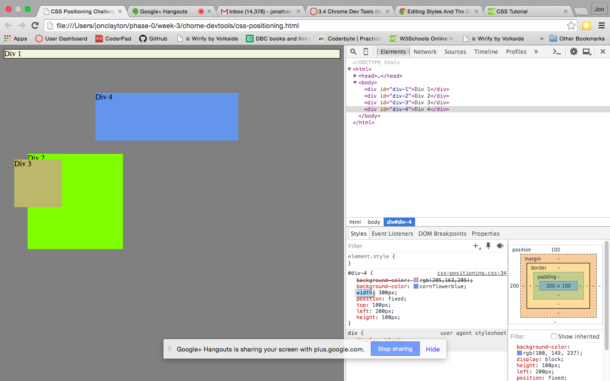
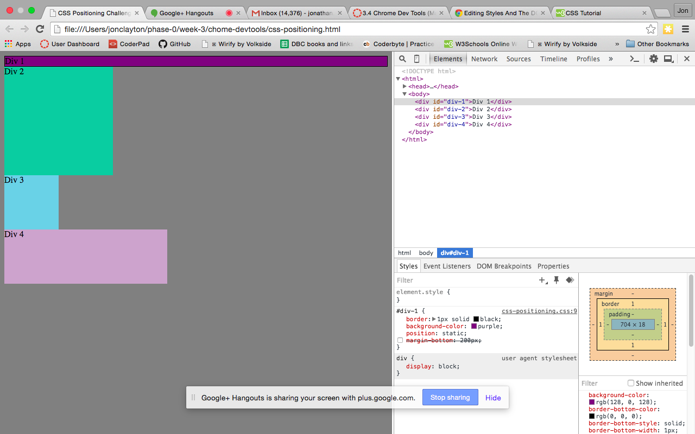
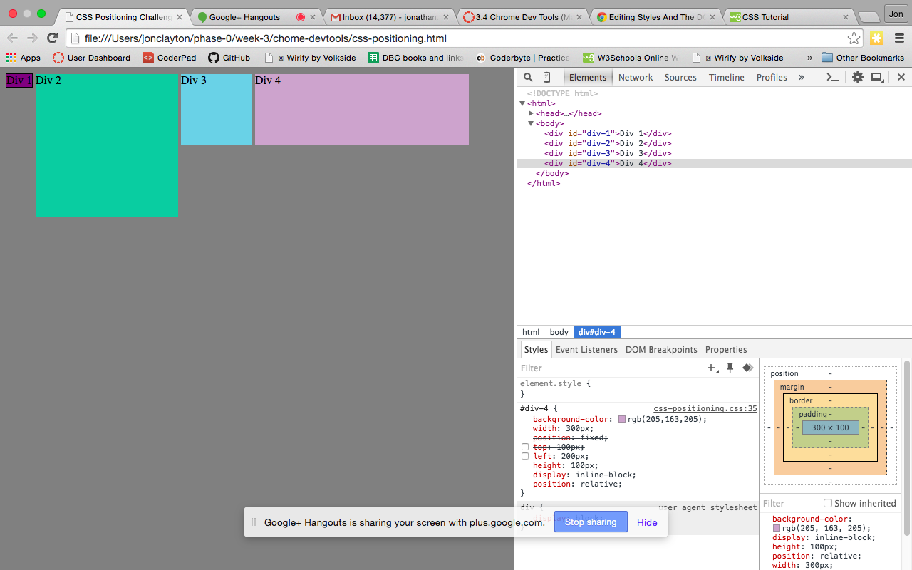
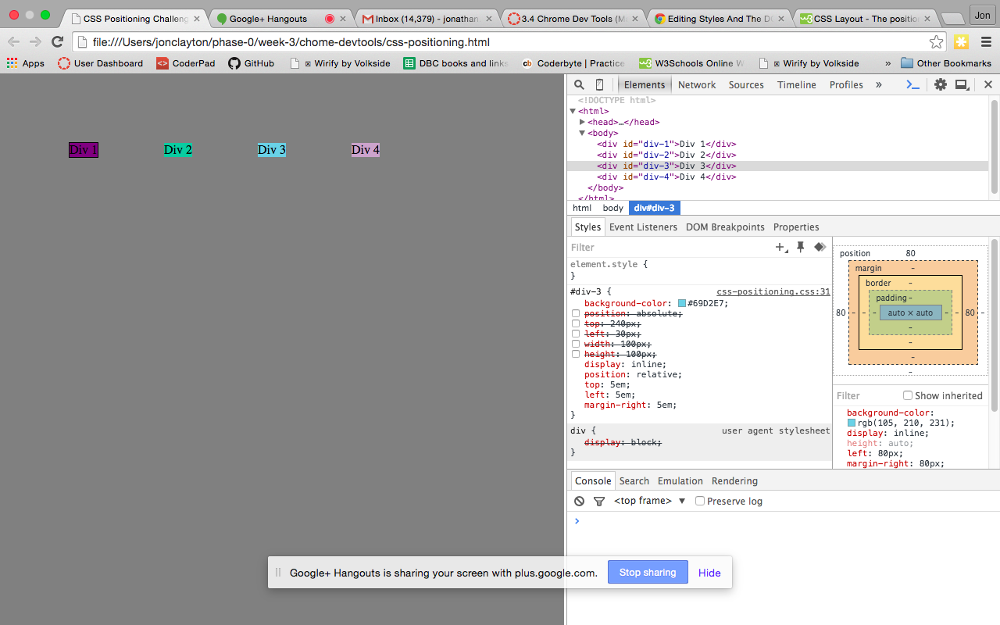
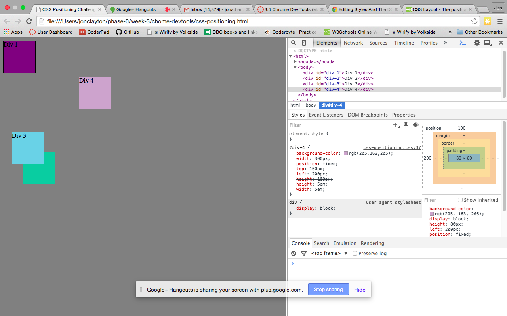
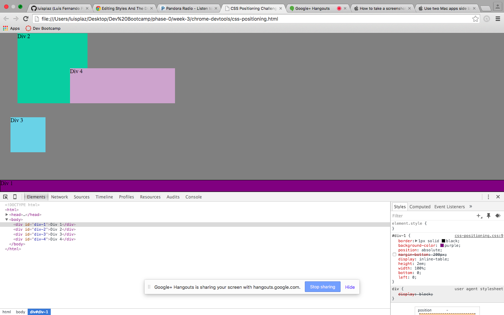
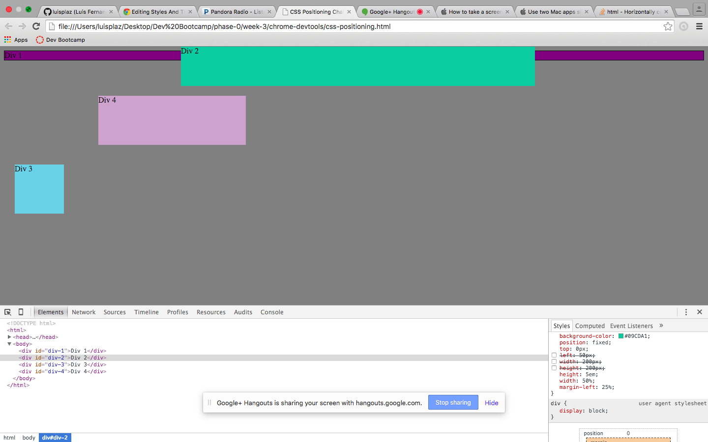
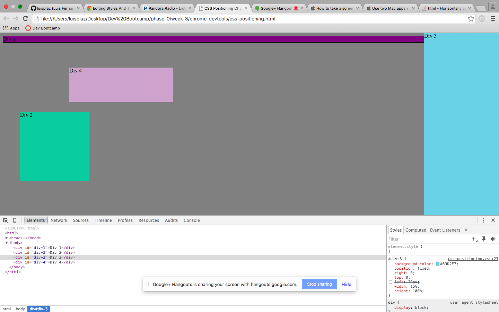
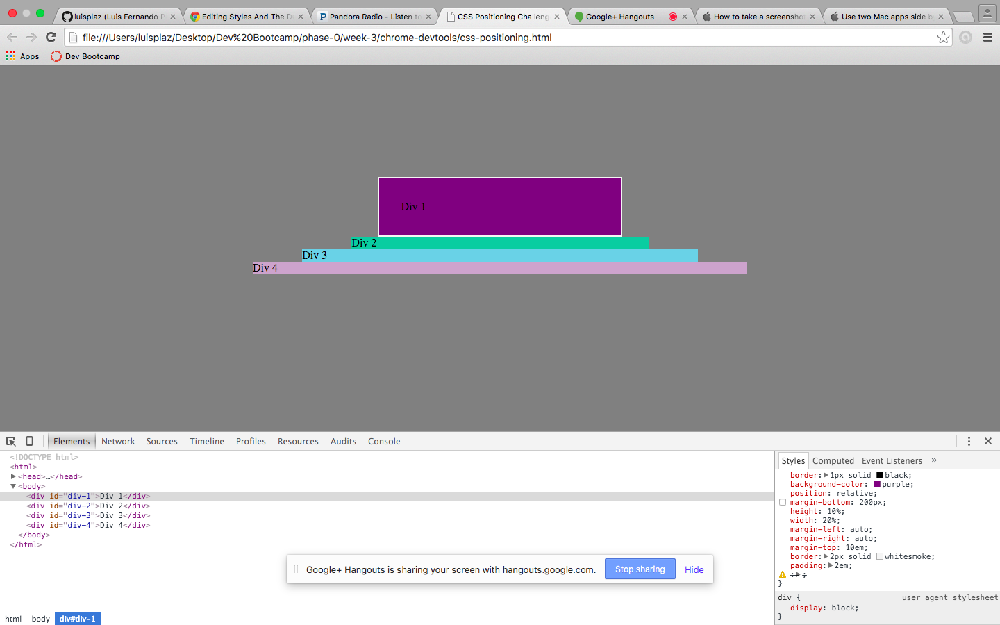

How can you use Chrome's DevTools inspector to help you format or position elements?
	It lets you turn on and off relevant parts of the CSS and add new CSS.  It's particularly nice because when you select an element it shows only the CSS that applies to that element.

How can you resize elements on the DOM using CSS?
	The easiest way to resize given the format of the CSS file was to change the height and width. You can change this within that element's type (class/ID, etc.) or in the parent type if the element's type has no settings for size.

What are the differences between Absolute, Fixed, Static, and Relative positioning?
	Static (default): follows the flow of the page, so position is based on that of the previous element without overlapping.  If no other instructions, this means below the previous element.  No top/bottom or left/right properties allowed.

	Relative: top/bottom and left/right properties create that much space on that side of the element from where it would have been in the Static location.  So Relative without non-zero top/bottom/left/right properties will be in the same place as Static would be. 

	Fixed: element goes in the position on the screen defined by top/bottom and left/right, and remains there regardless of scrolling. The direction properties describe the distance between the edge of the element and the edge of the screen.

	Absolute: element goes in a position relative to the previous element, so it is like the fixed positioning, except the prior object takes the place of the screen. Note that the direction properties, if positive, are describing locations inside the edges of the previous object.

Which did you find easiest to use? Which was most difficult?
	Fixed is very easy. Absolute was confusing. I think we were confused by a number of them and did a lot of trial and error using other properties rather than getting the ideal position property.

What are the differences between Margin, Border, and Padding?
	Padding is the space between the edge of the contents (e.g. text) and the inside edge of the border, and is colored with the background color of the element. Zero padding makes text looks scrunched in the element if there is a visible border. The border is the width of the "edge" of the element and has its own color.  If it is zero, it is invisible. The margin is the setoff between the element and other elements. It is transparent, and if it is zero for two adjacent elements, their borders will touch, but not overlap (so the line will appear extra thick if both are visible and in the same color).

What was your impression of this challenge overall? (love, hate, and why?)
	I loved it because it was a "play with until you solve it."
	I hated it because I think we got fouled up by not really understanding the four different positions, so it turned out to be trial and error and not really learning well. But this reflection has corrected that. I find the reflections are where I really refine what I learned by having to get it down on "paper."